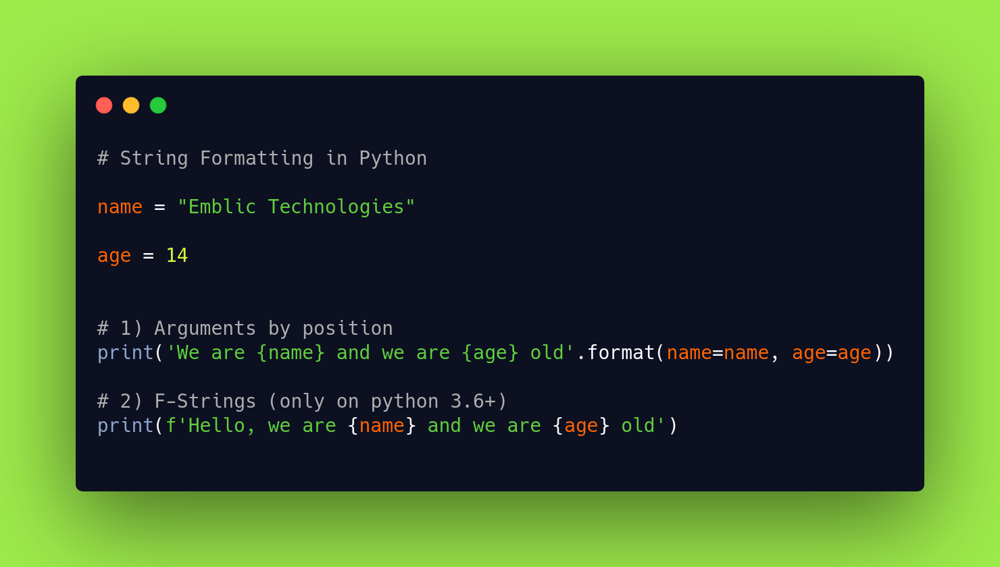

# Read Me Template



> This is a ReadMe template to help save you time and effort.

---

### Table of Contents

- [Description](#description)
- [How To Use](#how-to-use)
- [References](#references)
- [Author Info](#author-info)

---

## Description

This is a repository for shopify backend challenge. with some of the required features like:
- SEARCH function (from characteristics of the images, from text )
- ADD image(s) to the repository (one / bulk / enormous amount of images, private or public (permissions), secure uploading and stored images)
- DELETE image(s) (one, Prevent a user deleting images from another user (access control), secure deletion of images)


#### Technologies

- Flask Framework
- Bootstrap
- Xampp

---

## How To Use
- Download and instal [python3](https://www.python.org/downloads/)
- Download and instal python package manager [pip3](https://pip.pypa.io/en/stable/installing/)
- Download and install [xampp](https://www.apachefriends.org/index.html)

#### Installation
1. Clone the repo
   ```sh
    git clone github.com/izudada/shopifiy_image_repo_challenge.git
   ```
2.  Use pip to install all the project requirements/libraries
   ```sh
    pip3 install requirements.txt
   ```
3.  Open xammp, create new database "image_repo" and import "image_repo.sql" file

4.  open terminal and run:
   ```sh
    python3 app.py 
   ```
   or
   ```sh
    flask run
   ```
5.  Open a browser tab visit "http://localhost:5000/"

---

## References


---

## Author Info

- Twitter - [@_izudada](https://twitter.com/_izudada)


[Back To The Top](#read-me-template)